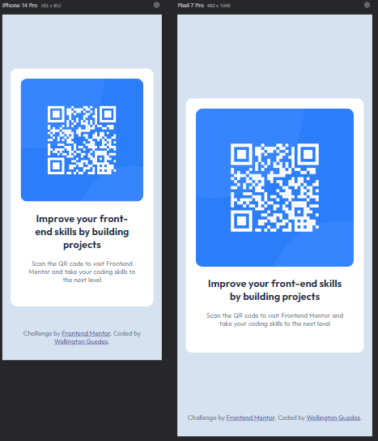
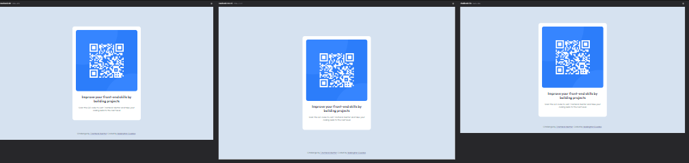

# QR Code Component - Frontend Mentor Challenge

Este projeto foi criado como parte do desafio do Frontend Mentor para construir um componente de QR Code. O foco principal foi criar uma solução simples e responsiva usando apenas HTML e CSS.

## Visão Geral
O objetivo deste desafio é construir um card de QR Code que seja responsivo em diferentes resoluções de tela, mantendo um design consistente e seguindo boas práticas de semântica e acessibilidade.

### Versão Mobile:


### Versão Desktop:



## Links
- [Live Site](https://wellingtonguedesdev.github.io/qr-code-component-main/)
- [Frontend Mentor Challenge](https://www.frontendmentor.io/challenges/qr-code-component-iux_sIO_H)

## Tecnologias Utilizadas
- HTML5: para a estrutura semântica da página.
- CSS3: para a estilização, incluindo layouts flexíveis e responsividade.

## Funcionalidades
- Design responsivo que se adapta a diferentes tamanhos de tela, até 1440px de largura.
- Estrutura semântica utilizando tags HTML corretas para acessibilidade.
- Layout centralizado e simétrico, adequado tanto para mobile quanto para desktop.

## Estrutura do Projeto
A estrutura do projeto segue um layout simples, com os seguintes arquivos principais:

- `index.html`: arquivo principal que define a estrutura básica da página.
- `styles/variables.css`: arquivo de variáveis de cores e fontes.
- `styles/index.css`: arquivo de estilos que estiliza a página.
- `images/`: diretório que contém as imagens utilizadas no projeto.

## Como Rodar o Projeto

acesse o link do deploy: https://wellingtonguedesdev.github.io/qr-code-component-main/

ou

```bash
git clone https://github.com/seu-usuario/qr-code-component.git
```
Abra o arquivo index.html no seu navegador.

## Créditos
Este projeto foi desenvolvido como parte do desafio Frontend Mentor. Design e especificações fornecidas pela plataforma.